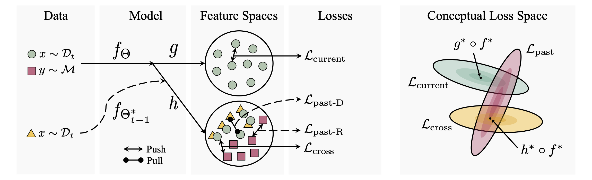

# Integrating Present and Past </br> in Unsupervised Continual Learning
This is the *PyTorch implementation* for our paper appearing at **CLVision 2024** as well as at **CoLLAs 2024**:


>**[Integrating Present and Past in Unsupervised Continual Learning](https://arxiv.org/abs/2404.19132)**<br>
>Yipeng Zhang, Laurent Charlin, Richard Zemel, Mengye Ren


**Abstract.** We formulate a unifying framework for *unsupervised continual learning (UCL)*, which disentangles learning objectives that are specific to the present and the past data, encompassing stability, plasticity, and cross-task consolidation. The framework reveals that many existing UCL approaches overlook cross-task consolidation and try to balance plasticity and stability in a shared embedding space. This results in worse performance due to a lack of within-task data diversity and reduced effectiveness in learning the current task. Our method, *Osiris*, which explicitly optimizes all three objectives on separate embedding spaces, achieves state-of-the-art performance on all benchmarks, including two novel ones proposed in this paper featuring semantically structured task sequences. Compared to standard benchmarks, these two structured benchmarks more closely resemble visual signals received by humans and animals when navigating real-world environments. Finally, we show some preliminary evidence that continual models can benefit from such more realistic learning scenarios.



## Setup 

We use the following packages, including *[wandb](https://docs.wandb.ai/quickstart)* for logging.

- python 3.8
- numpy 1.24.3
- torch 1.11.0
- torchvision 0.12.0
- cuda 11.3
- wandb 0.17.1
- tqdm 4.66.4

Please see the example script below for setting up with *Conda*. You can set `$ROOT_DIR` to your favourite directory.

```bash
conda create --name osiris python=3.8
conda activate osiris

conda install pytorch==1.11.0 torchvision==0.12.0 torchaudio==0.11.0 cudatoolkit=11.3 -c pytorch
pip install wandb tqdm

cd $ROOT_DIR
git clone https://github.com/SkrighYZ/Osiris.git
```

## Data

You can use the following script to download and restructure **CIFAR-100** and **Tiny-ImageNet-200** which we use in our experiments. Please set `$DATA_DIR` to the parent directory of the datasets. The script creates each dataset as a folder in `$DATA_DIR`.

```bash
# CIFAR-100
wget https://www.cs.toronto.edu/~kriz/cifar-100-python.tar.gz -P $DATA_DIR
tar -xf "$DATA_DIR"/cifar-100-python.tar.gz -C $DATA_DIR

# Tiny-ImageNet-200
cd $ROOT_DIR/Osiris
bash tiny-imagenet.sh
```

We provide random and structured class orders in folder `$ROOT_DIR/Osiris/data_order`. You can also add your own class orderings by following the format of the pickle files.

## Training

Please set `$out_dir` to a directory to store the results and checkpoints for **each** run. 

We perform [DDP training](https://pytorch.org/tutorials/intermediate/ddp_tutorial.html) on two NVIDIA Quadro RTX 8000 GPUs on a single computing node (`NUM_NODES=1`, `NUM_TRAINERS=2`). Feel free to use our code as a skeleton for DDP training of replay-based methods in the UCL setting. Single-GPU or multi-node training may require modifications. 

We tested our code with the following scripts in *Slurm*. Please modify them to accomodate your computing system.

```bash
#!/bin/bash
#SBATCH --nodes=$NUM_NODES
#SBATCH --ntasks-per-node=$NUM_TRAINERS
#SBATCH --cpus-per-task=2
#SBATCH --gpus-per-task=rtx8000:1
#SBATCH --mem=16G

# Use a unique port for each job
export MASTER_PORT=$(expr 12345 + $(echo -n $SLURM_JOBID | tail -c 4))
export MASTER_ADDR="127.0.0.1"

conda activate osiris
```


### Offline IID Training

```bash
num_tasks=1
```

- CIFAR-100

```bash
torchrun --master_port=$MASTER_PORT --master_addr=$MASTER_ADDR train.py --world_size $NUM_TRAINERS --dataset cifar100 --model simclr --num_tasks $num_tasks --epochs 200 --batch_size 256 --data_dir $DATA_DIR --order_fp $ROOT_DIR/Osiris/data_order/c100_random_order.pkl --lr 0.03 --weight_decay 5e-4 --log_freq 200 --eval_freq 1955 --save_dir $out_dir --distributed
```

- Tiny-ImageNet

```bash
torchrun --master_port=$MASTER_PORT --master_addr=$MASTER_ADDR train.py --dataset tinyimagenet --model simclr --num_tasks $num_tasks --epochs 200 --batch_size 256 --data_dir $DATA_DIR --order_fp $ROOT_DIR/Osiris/data_order/t200_structured_order.pkl --lr 0.03 --weight_decay 5e-4 --log_freq 200 --eval_freq 7820 --save_dir $out_dir --distributed
```


### Continual Training on Split-CIFAR-100

Set `$num_tasks` to the number of tasks. Also, choose the ordering file.

```bash
# Standard Split-CIFAR-100
order_fp=$ROOT_DIR/Osiris/data_order/c100_random_order.pkl

# Structured Split-CIFAR-100
order_fp=$ROOT_DIR/Osiris/data_order/c100_structured_order.pkl
``` 

- FT

```bash
torchrun --master_port=$MASTER_PORT --master_addr=$MASTER_ADDR train.py --dataset cifar100 --model simclr --num_tasks $num_tasks --epochs 200 --batch_size 256 --data_dir $DATA_DI --order_fp $order_fp --lr 0.03 --weight_decay 5e-4 --log_freq 200 --save_dir $out_dir --distributed
```

- Osiris-R

```bash
torchrun --master_port=$MASTER_PORT --master_addr=$MASTER_ADDR train.py --dataset cifar100 --model osiris-r --num_tasks $num_tasks --epochs 200 --batch_size 256 --data_dir $DATA_DIR --order_fp $order_fp --lr 0.03 --weight_decay 5e-4 --log_freq 200 --save_dir $out_dir --buffer_size 500 --p 0.75 --distributed
```

- Osiris-D

```bash
torchrun --master_port=$MASTER_PORT --master_addr=$MASTER_ADDR train.py --dataset cifar100 --model osiris-d --num_tasks $num_tasks --epochs 200 --batch_size 256 --data_dir $DATA_DIR --order_fp $order_fp --lr 0.03 --weight_decay 5e-4 --log_freq 200 --save_dir $out_dir --buffer_size 500 --p 0.75 --distributed
```


### Continual Training on Structured Tiny-ImageNet


```bash
num_tasks=10
order_fp=$ROOT_DIR/Osiris/data_order/t200_structured_order.pkl
```

- FT

```bash
torchrun --master_port=$MASTER_PORT --master_addr=$MASTER_ADDR train.py --dataset tinyimagenet --model simclr --num_tasks $num_tasks --epochs 200 --batch_size 256 --data_dir $DATA_DIR --order_fp $order_fp --lr 0.03 --weight_decay 5e-4 --log_freq 200 --save_dir $out_dir --t200_paths $ROOT_DIR/Osiris/data_order/t200_paths.txt --distributed
```

- Osiris-R

```bash
torchrun --master_port=$MASTER_PORT --master_addr=$MASTER_ADDR train.py --dataset tinyimagenet --model osiris-r --num_tasks $num_tasks --epochs 200 --batch_size 256 --data_dir $DATA_DIR -order_fp $order_fp --lr 0.03 --weight_decay 5e-4 --log_freq 200 --save_dir $out_dir --buffer_size 500 --p 0.75 --t200_paths $ROOT_DIR/Osiris/data_order/t200_paths.txt --distributed
```

- Osiris-D

```bash
torchrun --master_port=$MASTER_PORT --master_addr=$MASTER_ADDR train.py --dataset tinyimagenet --model osiris-d --num_tasks $num_tasks --epochs 200 --batch_size 256 --data_dir $DATA_DIR -order_fp $order_fp --lr 0.03 --weight_decay 5e-4 --log_freq 200 --save_dir $out_dir --buffer_size 500 --p 0.75 --t200_paths $ROOT_DIR/Osiris/data_order/t200_paths.txt --distributed
```

## Evaluation

For evaluation, we need the checkpoints stored after each task during training for the continual models, or the final checkpoint for the offline models. For offline models, we only need the final checkpoint; please add the `--offline` flag in this case. 

- Standard Split-CIFAR-100

```bash
python eval.py --dataset cifar100 --num_tasks $num_tasks --data_dir $DATA_DIR --ckpt_dir $out_dir --order_fp $ROOT_DIR/Osiris/data_order/c100_random_order.pkl --eval_batch_size 64
```

- Structured Split-CIFAR-100

```bash
python eval.py --dataset cifar100 --num_tasks $num_tasks --data_dir $DATA_DIR --ckpt_dir $out_dir --order_fp $ROOT_DIR/Osiris/data_order/c100_structured_order.pkl --eval_batch_size 64
```

- Structured Tiny-ImageNet

```bash
python eval.py --dataset tinyimagenet --num_tasks 10 --data_dir $DATA_DIR --ckpt_dir $out_dir --order_fp $ROOT_DIR/Osiris/data_order/t200_structured_order.pkl --eval_batch_size 64
```


## Acknowledgment
Our code borrows pieces from [Spijkervet/SimCLR](https://github.com/Spijkervet/SimCLR), [facebookresearch/moco](https://github.com/facebookresearch/moco), [facebookresearch/barlowtwins](https://github.com/facebookresearch/barlowtwins), and [divyam3897/UCL](https://github.com/divyam3897/UCL).


## Citation

```bibtex
@article{zhang2024integrating,
  title={Integrating Present and Past in Unsupervised Continual Learning},
  author={Zhang, Yipeng and Charlin, Laurent and Zemel, Richard and Ren, Mengye},
  journal={arXiv preprint arXiv:2404.19132},
  year={2024}
}
```

